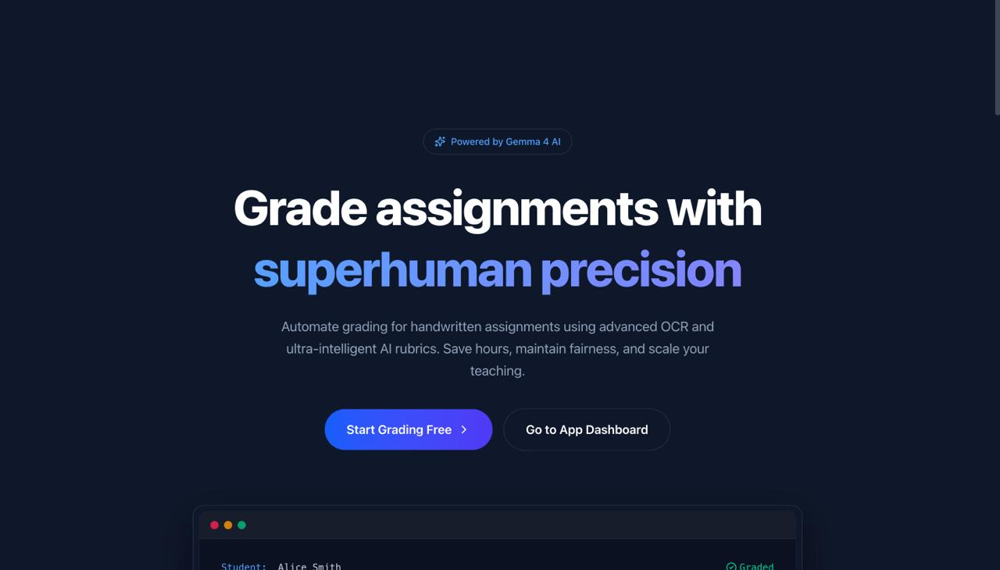
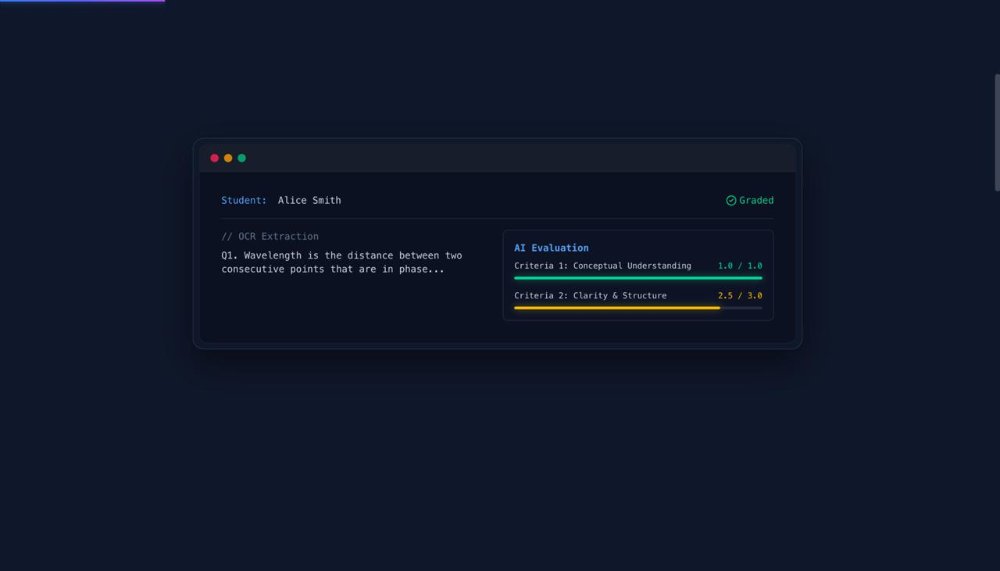
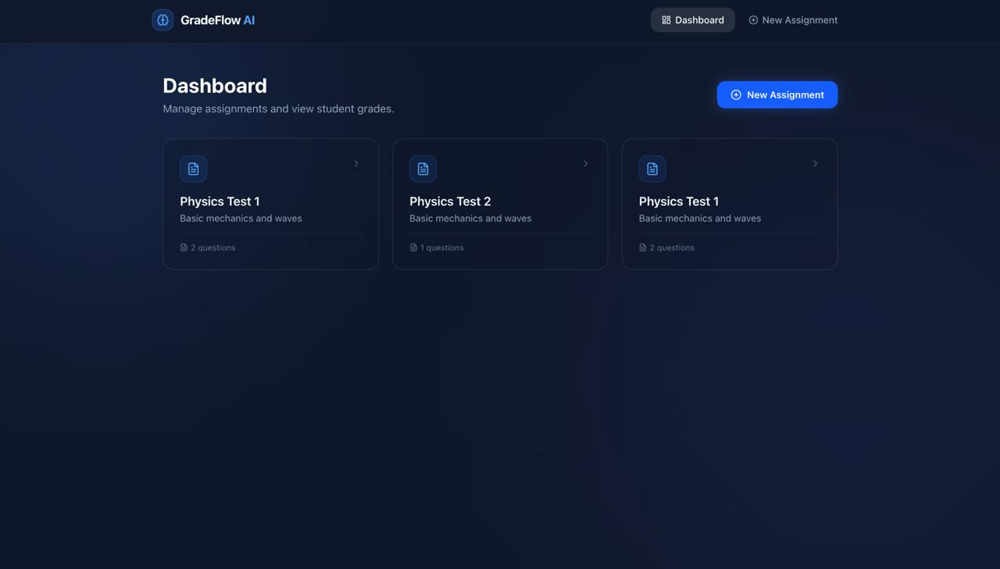
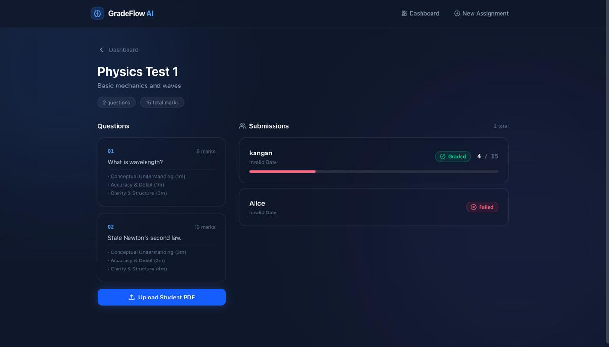
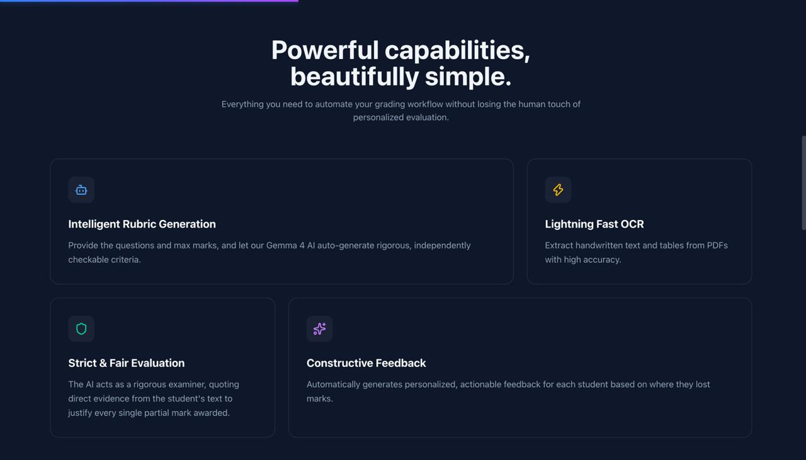
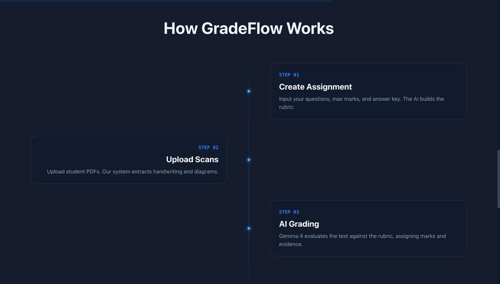
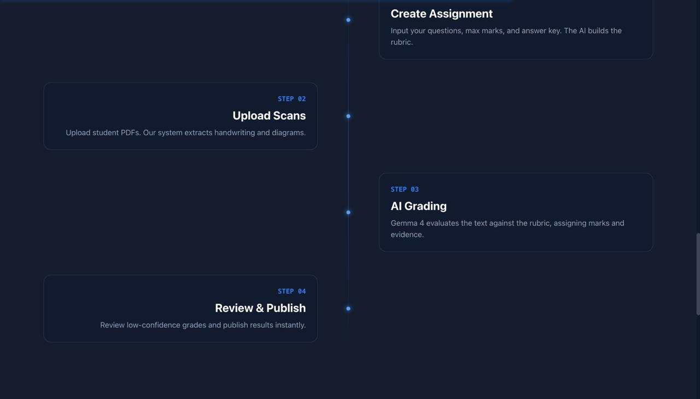

# GradeFlow-AI 🎓⚡
> **Next-Generation Autonomous Multimodal Grading & Evaluation Engine with Human-in-the-Loop Auditing**

[](https://fastapi.tiangolo.com)
[](https://python.org)
[](https://supabase.com)
[](https://ai.google.dev/gemma)
[](https://github.com/QwenLM/Qwen-VL)
[](https://ollama.com)
[](LICENSE)

---

<p align="center">
  
</p>

---

## 📌 Executive Summary

Manual grading of academic scripts—comprising **handwritten theory**, **complex technical diagrams**, and **structured data tables**—is notoriously time-consuming, inconsistent, and prone to evaluator fatigue.

**GradeFlow-AI** is a high-performance, privacy-first, end-to-end evaluation pipeline that automates the assessment of handwritten student exam papers with mathematical rigor, verbatim textual evidence citation, and confidence-scored rubric compliance.

By pairing a specialized vision-language model (**Qwen3-VL**) for document layout and handwriting OCR with a local reasoning model (**Gemma E2B**) for multi-criteria rubric evaluation, GradeFlow-AI delivers reliable, auditable, and transparent grading directly on development hardware without recurring cloud API fees.

<p align="center">
  
</p>

---

## 📸 Product Walkthrough & UI Showcase

### 1. Educator Dashboard
A streamlined management console displaying active exam assignments, question counts, and submission statuses.

<p align="center">
  
</p>

### 2. Assignment Details & Submissions Pipeline
Inspect question-level rubric criteria and mark weights, upload student handwritten PDF scans, and monitor automated scoring with evidence justification.

<p align="center">
  
</p>

### 3. Intelligent Evaluation Capabilities
Comprehensive multi-modal evaluation combining automated rubric synthesis, high-accuracy handwriting OCR, strict evidence grounding, and personalized student feedback.

<p align="center">
  
</p>

### 4. End-to-End Grading Workflow
A friction-free four-stage pipeline guiding educators from rubric creation to automated grading and final human-in-the-loop publication.

| Step 01–03: Setup, Ingestion & AI Grading | Step 02–04: OCR, Evaluation & Verification |
| :---: | :---: |
|  |  |

---

## 🏗️ High-Level System Architecture

```text
┌─────────────────┐
│     FACULTY     │
└────────┬────────┘
         │ 1. Question + Answer Key + Max Marks
         ▼
┌─────────────────┐
│     GEMMA 4     │
│ Rubric Generator│ ──► [Rubric: Criteria + Weights + Constraints]
└────────┬────────┘
         │
         ▼
┌─────────────────┐        ┌───────────────────────┐
│   STUDENT PDF   │ ─────► │   PDF Preprocessing   │
│  (Handwritten)  │        │   PyMuPDF (150-200 DPI)│
└─────────────────┘        └───────────┬───────────┘
                                       │ Page Images
                                       ▼
                           ┌───────────────────────┐
                           │       QWEN3-VL        │
                           │  Multimodal Vision    │
                           │  Handwriting + Tables │
                           │  + Diagram Extraction │
                           └───────────┬───────────┘
                                       │ Question-Wise Structured JSON
                                       ▼
                           ┌───────────────────────┐
                           │    LOCAL GEMMA E2B    │
                           │   Evaluation Agent    │
                           │   Behind GemmaClient  │
                           └───────────┬───────────┘
                                       │
        ┌──────────────────────────────┼──────────────────────────────┐
        ▼                              ▼                              ▼
 ┌─────────────┐                ┌─────────────┐                ┌─────────────┐
 │ Correctness │                │Part Credit  │                │ Evidence &  │
 │  Analysis   │                │ Compliance  │                │ Reasoning   │
 └──────┬──────┘                └──────┬──────┘                └──────┬──────┘
        └──────────────────────────────┼──────────────────────────────┘
                                       ▼
                           ┌───────────────────────┐
                           │ Strict Pydantic Guard │
                           │ + Safe JSON Extraction│
                           │ + 1-Shot Retry Repair │
                           └───────────┬───────────┘
                                       │ Validated Scores + Confidence
                                       ▼
                           ┌───────────────────────┐
                           │  Supabase PostgreSQL  │
                           │ Results + JSONB State │
                           └───────────┬───────────┘
                                       │
                                       ▼
                           ┌───────────────────────┐
                           │     HUMAN REVIEW      │
                           │ Faculty Audit & Sign  │
                           │ (Confidence Routing)  │
                           └───────────┬───────────┘
                                       │
                                       ▼
                              [FINAL VERIFIED MARKS]
```

---

## 🌟 Key Innovations & Engineering Highlights

### 1. Zero-Cloud Privacy & Local Inference
- **100% On-Premise Execution Option**: Both **Gemma E2B** and **Qwen3-VL** can run locally using **Ollama** or **Hugging Face Transformers**.
- **Edge-Optimized**: Designed for development and deployment on resource-constrained hardware (e.g., NVIDIA GeForce RTX 3050 4GB VRAM) leveraging quantized execution, automatic GPU memory offloading, and intelligent CPU fallback.
- **Model Decoupling**: Application logic interacts purely through the abstract `GemmaClient` and `QwenClient` interfaces—runtimes can be swapped without touching grading logic.

### 2. Multi-Modal Handwritten Document Deconstruction
Student papers are partitioned into distinct semantic modalities:
- **Theory**: Verbatim transcription preserving student voice, annotating illegible text with `[illegible]` tokens to prevent generative hallucination.
- **Structured Tables**: Extracted into relational row-column arrays for deterministic, cell-by-cell key verification.
- **Technical Diagrams**: Transcribed into structured node-edge graph representations for topological comparison against faculty reference keys.

### 3. Rubric-Bound, Evidence-Grounded Scoring
- **No Arbitrary Marks**: Every awarded point is strictly bounded by criterion-level maximums (`0 <= awarded_marks <= criterion.max_marks`).
- **Verbatim Evidence Linking**: The model must extract an exact substring from the student's transcribed text into the `evidence` field justifying every awarded point.
- **No Fabrication**: If an answer is missing or illegible, marks are set to `0.0` with `needs_review=true`; missing criteria or hallucinations are strictly prevented.

### 4. Self-Healing JSON Output & Validation Pipeline
- **Tier 1 (Safe Extraction)**: Regex-based extraction handles clean JSON, Markdown codeblocks (````json ... ````), and thinking tags (`<thought>...</thought>`).
- **Tier 2 (Pydantic Schema Validation)**: Strictly validates criterion scores, totals, evidence, and confidence bounds against `QuestionGradingResult`.
- **Tier 3 (1-Shot Automated Repair)**: If initial output fails syntax or schema validation, a deterministic retry prompt is triggered requesting JSON-only correction.
- **Tier 4 (Fail-Safe Review Escalation)**: If validation fails after retry, the paper is automatically flagged with `needs_review=true` and escalated to human audit.

### 5. Confidence-Driven Human-in-the-Loop Routing
- Each graded answer outputs an `overall_confidence` score (0.0 to 1.0).
- Submissions below the confidence threshold or containing ambiguous extractions bypass automatic finalization and enter a prioritized faculty review queue.

---

## 🛠️ Technology Stack

| Layer | Technology | Rationale |
| :--- | :--- | :--- |
| **Frontend UI** | React 19 + TypeScript (Vite), Tailwind CSS, shadcn/ui | Fast, reactive interface with side-by-side PDF and score breakdown. |
| **Document Viewer** | PDF.js / react-pdf with Canvas Overlays | Real-time visual grounding of model evidence against physical page coordinates. |
| **Backend API** | Python 3.12 + FastAPI, Uvicorn | High-throughput async API co-located with Python AI ecosystem. |
| **Database & Storage** | Supabase (PostgreSQL + Storage) | Relational schema with `JSONB` flexibility for unstructured AI extractions and encrypted PDF storage. |
| **PDF Preprocessing** | PyMuPDF (`fitz`) | High-fidelity 150–200 DPI image rasterization with near-zero memory footprint. |
| **Vision Model** | Qwen3-VL (2B / 8B) via Ollama | Specialized for handwriting, spatial reasoning, tables, and diagrams. |
| **Reasoning Model** | Gemma 4 E2B via Ollama / Transformers | Lightweight, accurate, Apache 2.0 reasoning model for rubric evaluation. |
| **Validation Layer** | Pydantic v2 Settings & Models | Strict runtime type enforcement, mark clamping, and JSON schema guarantees. |

---

## 🗄️ Database Architecture (Supabase / PostgreSQL)

GradeFlow-AI utilizes a clean, normalized relational schema with `JSONB` payloads for flexible model telemetry:

```sql
-- Core Assignments
create table assignments (
    id          uuid primary key default gen_random_uuid(),
    title       text not null,
    description text,
    created_at  timestamptz default now()
);

-- Question Bank & Rubrics
create table questions (
    id            uuid primary key default gen_random_uuid(),
    assignment_id uuid not null references assignments(id) on delete cascade,
    number        text not null,
    text          text not null,
    max_marks     numeric not null,
    answer_key    text,
    rubric        jsonb, -- Structured criteria generated by Gemma or Faculty
    created_at    timestamptz default now()
);

-- Submissions Lifecycle
create table submissions (
    id            uuid primary key default gen_random_uuid(),
    assignment_id uuid not null references assignments(id) on delete cascade,
    student_name  text not null,
    file_path     text not null,
    status        text not null default 'uploaded'
                  check (status in ('uploaded','processing','graded','failed')),
    error         text,
    submitted_at  timestamptz default now()
);

-- Comprehensive Grading Results
create table results (
    id            uuid primary key default gen_random_uuid(),
    submission_id uuid not null unique references submissions(id) on delete cascade,
    extraction    jsonb,    -- Qwen OCR structured transcription per question
    evaluation    jsonb,    -- Gemma criterion-wise marks, evidence & reasoning
    total_marks   numeric,
    max_total     numeric,
    needs_review  boolean default false,
    created_at    timestamptz default now()
);
```

---

## 📡 API Specification

### Health & Readiness
- `GET /health` — Service liveness ping.
- `GET /health/ai` — Real-time AI subsystem status check:
  ```json
  {
    "qwen": "available",
    "gemma": "available",
    "pipeline": "ready"
  }
  ```
  *(If Gemma is offline, returns `{"gemma": "unavailable", "pipeline": "not_ready"}` without crashing FastAPI).*

### Direct Question Evaluation
- `POST /api/grade/question` — Evaluates a single question with rubric & student answer:
  ```json
  {
    "question": {
      "number": "Q1",
      "text": "Explain deadlock and list two necessary conditions.",
      "max_marks": 5.0,
      "answer_key": "Deadlock is a state where processes wait indefinitely for resources..."
    },
    "rubric": {
      "criteria": [
        {"id": "c1", "description": "Accurate definition", "max_marks": 2.0},
        {"id": "c2", "description": "Two conditions named", "max_marks": 2.0},
        {"id": "c3", "description": "Example provided", "max_marks": 1.0}
      ]
    },
    "student_answer": {
      "text": "Deadlock happens when processes cannot proceed waiting on each other. Conditions: mutual exclusion and circular wait."
    }
  }
  ```
  **Response**:
  ```json
  {
    "question_id": "Q1",
    "criteria": [
      {
        "criterion_id": "c1",
        "awarded_marks": 2.0,
        "max_marks": 2.0,
        "evidence": "Deadlock happens when processes cannot proceed waiting on each other.",
        "reason": "Accurate high-level conceptual definition provided.",
        "confidence": 1.0
      },
      {
        "criterion_id": "c2",
        "awarded_marks": 2.0,
        "max_marks": 2.0,
        "evidence": "Conditions: mutual exclusion and circular wait.",
        "reason": "Two valid Coffman conditions correctly identified.",
        "confidence": 1.0
      },
      {
        "criterion_id": "c3",
        "awarded_marks": 0.0,
        "max_marks": 1.0,
        "evidence": "Not mentioned",
        "reason": "Student did not provide an illustrative example.",
        "confidence": 1.0
      }
    ],
    "total_marks": 4.0,
    "max_marks": 5.0,
    "overall_confidence": 1.0,
    "needs_review": false
  }
  ```

### Submission Lifecycle
- `POST /api/submissions/{id}/grade` — Triggers complete pipeline (PDF download → PyMuPDF rasterization → Qwen3-VL OCR → Gemma E2B grading → Supabase storage).
- `GET /api/submissions/{id}/result` — Retrieves finalized extraction, evaluations, marks, and review status.

---

## 🚀 Quickstart & Setup Guide

### 1. Prerequisites
- Linux / macOS / WSL2
- Python 3.11+
- [Ollama](https://ollama.com) installed (`curl -fsSL https://ollama.ai/install.sh | sh`)
- Supabase account & project

### 2. Environment Setup
```bash
git clone https://github.com/codie-ds/GradeFlow-AI.git
cd GradeFlow-AI/backend

# Initialize Virtual Environment
python3 -m venv .venv
source .venv/bin/activate

# Install Dependencies
pip install -r requirements.txt
```

### 3. Configure Environment Variables
Create `.env` inside `backend/`:
```env
# Supabase Configuration
SUPABASE_URL=https://your-project.supabase.co
SUPABASE_SERVICE_KEY=your-service-role-key
STORAGE_BUCKET=submissions

# Vision & OCR Model (Local Ollama)
QWEN_BASE_URL=http://localhost:11434
QWEN_MODEL=qwen3-vl:2b

# Reasoning & Grading Model (Local Ollama - No API Key Needed)
GEMMA_MODEL=gemma4:e2b
GEMMA_RUNTIME=ollama
GEMMA_BASE_URL=http://localhost:11434
```

### 4. Verify Local AI Models
Run the automated verification scripts:
```bash
# Verify & Warm-up Gemma E2B
python scripts/setup_gemma.py

# Verify & Warm-up Qwen3-VL
python scripts/setup_qwen.py
```
*Expected Output:*
```text
────────────────────────────────────────
Gemma E2B
Model: gemma4:e2b
Runtime: ollama
Status: READY
────────────────────────────────────────
```

### 5. Run the Test Suite
```bash
python -m pytest tests/ -v
```
*19 unit & integration tests covering JSON parsing, client abstractions, fallbacks, and grading guarantees.*

### 6. Start the API Server
```bash
uvicorn app.main:app --host 0.0.0.0 --port 8000 --reload
```
Interactive Swagger docs will be live at `http://localhost:8000/docs`.

---

## 🎯 Hackathon Highlights & Competitive Advantage

| Feature | GradeFlow-AI | Traditional LLM Grading | Generic OCR + Regex |
| :--- | :---: | :---: | :---: |
| **Handwritten Equations & Layout** | ✅ **Qwen3-VL Multimodal** | ❌ Fails on raw text | ❌ Poor handwriting accuracy |
| **Strict Evidence Grounding** | ✅ **Verbatim Quotes Required** | ❌ Hallucinates evidence | ❌ No semantic grounding |
| **Criterion-Level Scoring** | ✅ **Strict Pydantic Bounds** | ❌ Arbitrary overall score | ❌ Rigid keyword matching |
| **Privacy & Cost** | ✅ **Zero-Cost Local Inference** | ❌ Expensive cloud token fees | ❌ Limited reasoning capability |
| **Self-Healing Schemas** | ✅ **1-Shot Auto-Repair** | ❌ Frequent JSON parse errors | ❌ Fragile custom parsers |
| **Human-in-the-Loop Audit** | ✅ **Confidence-Routed Review** | ❌ Black-box automation | ❌ High manual overhead |

---

## 🔮 Roadmap & Next Steps
- [ ] **Bounding Box Visual Evidence**: Overlay PDF bounding-box highlights directly in the React review dashboard using PDF.js canvas.
- [ ] **Diagram Graph Equivalence**: Compile extracted flowcharts and network diagrams into Mermaid/Graphviz ASTs for deterministic graph isomorphism checks.
- [ ] **Student Growth Insights**: Generate automated personalized feedback summaries and study recommendations based on recurring rubric deficiencies.
- [ ] **LMS Integration**: LTI 1.3 plug-in compatibility for Canvas, Moodle, and Google Classroom.

---

<p align="center">
  
</p>

---

## 📄 License
This project is licensed under the MIT License — see the [LICENSE](LICENSE) file for details.
